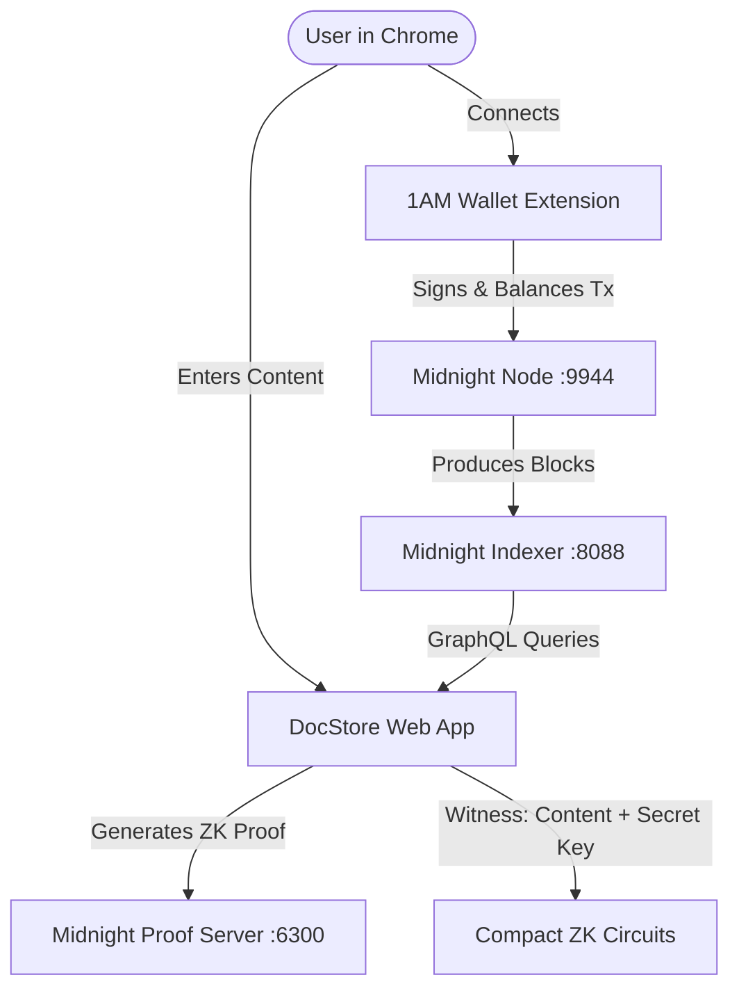

# 🗄️ DocStore — Privacy-Preserving Document Storage on Midnight Network

DocStore is a Zero-Knowledge (ZK) privacy-preserving document storage application built on the **Midnight Network** (Cardano's data-protection partner chain).

With DocStore, document metadata (title, category, timestamps, encrypted payload reference) is published on-chain, while the document content itself **never leaves your browser or wallet**. Ownership and content possession are proven cryptographically using Zero-Knowledge circuits.

---

## ✨ Features

- **🔒 Zero-Knowledge Privacy**: Document plaintext is treated as a private witness. Only its SHA-256 hash (`documentId`) reaches the blockchain.
- **👛 1AM Wallet Integration**: Seamless web connection to the Midnight 1AM Wallet Chrome Extension (`window.midnight['1am']`).
- **⚡ ZK Circuits**:
  - `storeDocument`: Proves knowledge of document content and owner private key, storing metadata on-chain.
  - `proveKnowledge`: Proves caller owns the document and knows the exact content without disclosing any bytes.
  - `checkGrant` / `grantKey`: Checks access grants between owners and grantees on the public ledger.
  - `refuseCorruption`: Publishes owner-verified refusal alarms for corrupted grant claims.
  - `computeHash` / `publicKey`: Pure circuit utilities for persistent hashes and owner public keys.
- **🌐 Modern Web Dashboard**: Live web interface with dark Midnight theme, address resolution, real-time tNIGHT / tDUST balances, and document explorer.
- **🐳 Docker Devnet Ready**: Pre-configured `compose.yml` orchestrating Midnight Node, Indexer, and Proof Server.

---

## 🏗️ Architecture



---

## 🚀 Quick Start

### 1. Prerequisites
- [Docker Desktop](https://www.docker.com/products/docker-desktop/) (for local devnet)
- [Node.js](https://nodejs.org/) (v22+)
- [1AM Wallet Chrome Extension](https://github.com/midnight-ntwrk)

### 2. Start Local Devnet (Docker)
Start the local Midnight Node, Indexer, and Proof Server:
```bash
docker compose up -d
```

### 3. Start the Web Server
Launch the DocStore web server:
```bash
node server.js
```
Open **[http://127.0.0.1:5174](http://127.0.0.1:5174)** in Google Chrome.

---

## 💻 CLI Commands

| Command | Description |
|---|---|
| `node server.js` | Starts the web server for Chrome and 1AM Wallet |
| `npm run check-balance` | Checks wallet balance on the local devnet |
| `npm run deploy` | Deploys the DocStore Compact contract |
| `npm run cli` | Interactive command-line interface |
| `npm run compile` | Compiles `contracts/DocStore.compact` |
| `docker compose up -d` | Starts local Midnight devnet services |

---

## 📜 Smart Contract (`DocStore.compact`)

Written in **Compact**, Midnight's domain-specific language for Zero-Knowledge smart contracts.

```compact
export struct Document {
  documentId: Bytes<32>,
  owner: Bytes<32>,
  title: Opaque<"string">,
  category: Opaque<"string">,
  createdAt: Uint<64>,
  updatedAt: Uint<64>,
}

export ledger documents: Map<Bytes<32>, Document>;
export ledger payload: Map<Bytes<32>, PayloadEnvelope>;
export ledger grants: Map<Bytes<32>, Uint<64>>;
export ledger onChainCounter: Counter;

// Witness inputs - NEVER leave the wallet:
witness documentContent(): Bytes<256>;
witness ownerPrivateKey(): Bytes<32>;
```

---

## 📄 License
Apache-2.0
